# CloudBoard — Architecture

> **Audience**: Students learning Clean Architecture, Azure, and .NET 9.
> This document describes the high-level architecture, project responsibilities, data flow, and key design decisions.

---

## Table of Contents

1. [Solution Overview](#solution-overview)
2. [High-Level System Diagram](#high-level-system-diagram)
3. [Clean Architecture Layers](#clean-architecture-layers)
4. [Project Dependency Graph](#project-dependency-graph)
5. [Data Model (ER Diagram)](#data-model-er-diagram)
6. [API Request Flow](#api-request-flow)
7. [CQRS Pattern — MediatR vs. Hand-Rolled](#cqrs-pattern--mediatr-vs-hand-rolled)
8. [Authentication & Authorization](#authentication--authorization)
9. [Cosmos DB Design](#cosmos-db-design)
10. [Blob Storage Design](#blob-storage-design)
11. [Azure Functions Integration](#azure-functions-integration)
12. [Paging Strategy](#paging-strategy)
13. [Feature Flags & Swappable Infrastructure](#feature-flags--swappable-infrastructure)

---

## Solution Overview

CloudBoard is a "tasks / notes / files" collaboration platform organized around **Workspaces**.
Each workspace can have members, tags, comments, and an activity log.

| Project | SDK / Type | Purpose | Local Port |
|---|---|---|---|
| `CloudBoard.Domain` | Class Library | Entities, value objects, enums — zero NuGet deps | — |
| `CloudBoard.Application` | Class Library | CQRS commands/queries, DTOs, interfaces, validators | — |
| `CloudBoard.Infrastructure` | Class Library | Cosmos repos, Blob storage, Functions client | — |
| `CloudBoard.Api` | ASP.NET Core Web API | REST controllers, auth, DI, Swagger | `https://localhost:7100` |
| `CloudBoard.Client` | Blazor WASM (standalone) | End-user UI, calls API via HttpClient | `https://localhost:7300` |
| `CloudBoard.AdminPortal` | Blazor Server (InteractiveServer) | Admin UI for SystemAdmin + WorkspaceAdmin | `https://localhost:7200` |
| `CloudBoard.Functions` | Azure Functions v4 (isolated worker) | Serverless jobs triggered by the API only | `http://localhost:7071` |

---

## High-Level System Diagram

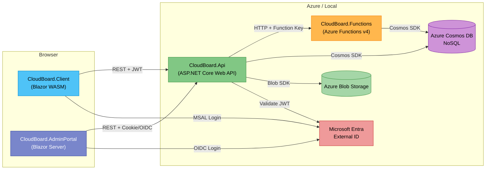

### Key rules

- **Client never calls Functions directly** — the API is the single gateway.
- **AdminPortal calls the same API** — it shares the API app registration in Entra.
- **Functions are HTTP-triggered with function keys** — only the API knows the key.

---

## Clean Architecture Layers

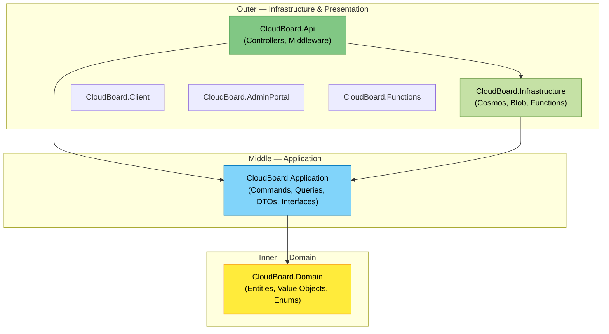

### The Dependency Rule

> Inner layers **never** reference outer layers.

| Layer | Can reference | Cannot reference |
|---|---|---|
| **Domain** | Nothing | Application, Infrastructure, Api |
| **Application** | Domain | Infrastructure, Api |
| **Infrastructure** | Domain, Application | Api |
| **Api** | Application, Infrastructure | — |

The Application layer defines **interfaces** (e.g., `IWorkspaceRepository`, `IBlobStorageService`).
The Infrastructure layer provides **implementations** (e.g., `CosmosWorkspaceRepository`, `BlobStorageService`).
The Api layer wires them together in `Program.cs` via dependency injection.

---

## Project Dependency Graph

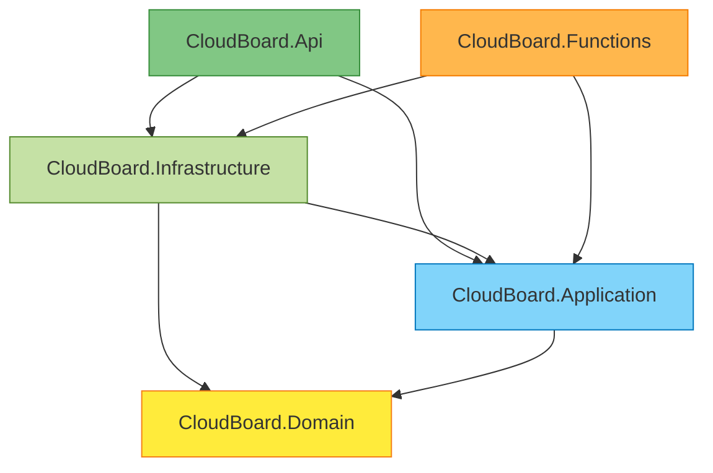

> `CloudBoard.Client` and `CloudBoard.AdminPortal` are standalone front-end apps — they call the API over HTTP and have **no project reference** to any backend project.

---

## Data Model (ER Diagram)

All entities live in a **single Cosmos container** (`WorkspaceData`) with partition key `/workspaceId` and a `docType` discriminator.

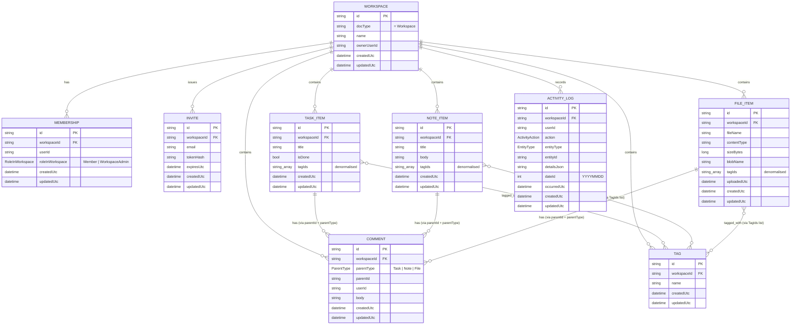

### Key design decisions

| Decision | Reason |
|---|---|
| Single container with `docType` discriminator | Cosmos free tier allows only 1 container with shared throughput (1000 RU/s). Splitting later is easy because all queries already filter by `docType`. |
| Partition key = `/workspaceId` | All data for a workspace lives in the same logical partition. Queries scoped to a workspace are cheap single-partition reads. |
| Tag IDs stored inline on items (`TagIds` list) | Avoids cross-partition joins. Cosmos has no JOIN across partitions — denormalisation is the standard pattern. |
| Comment uses `ParentType` + `ParentId` | Polymorphic reference avoids three separate comment tables. Common in document databases. |
| `DateId` on ActivityLog (int `YYYYMMDD`) | Enables cheap range filtering without full datetime comparison — useful for daily summaries. |

---

## API Request Flow

### MediatR flow (Workspaces, Notes, Tags)

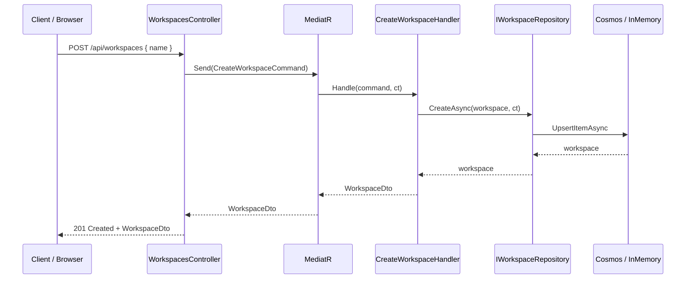

### Hand-rolled flow (Tasks, Files, Comments, etc.)

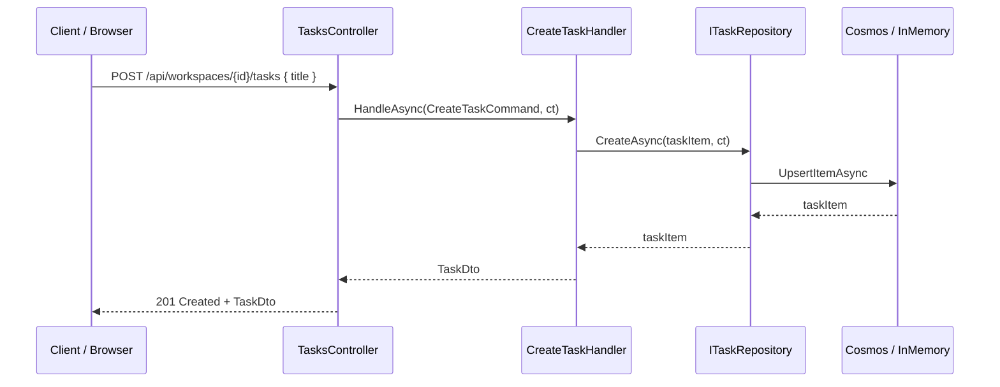

> **Why both patterns?** Students learn MediatR (industry standard) and hand-rolled CQRS (simpler, less magic). This makes it easier to understand what MediatR does under the hood.

---

## CQRS Pattern — MediatR vs. Hand-Rolled

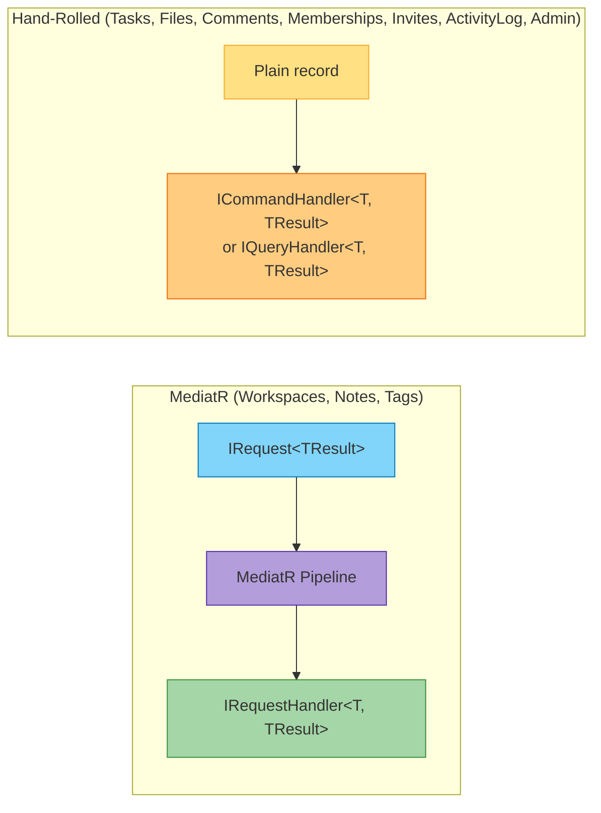

| Aspect | MediatR | Hand-Rolled |
|---|---|---|
| **Used for** | Workspaces, Notes, Tags | Tasks, Files, Comments, Memberships, Invites, ActivityLog, Admin |
| **Command type** | Implements `IRequest<T>` | Plain `record` class |
| **Handler type** | `IRequestHandler<TCommand, TResult>` | `ICommandHandler<TCommand, TResult>` / `IQueryHandler<TQuery, TResult>` |
| **Registration** | Auto-scanned by `AddMediatR()` | Manual registration in `DependencyInjection.cs` |
| **Pipeline behaviours** | Supports behaviours (validation, logging) | Add manually if needed |
| **Controller call** | `mediator.Send(command)` | `handler.HandleAsync(command, ct)` |

### When to use which

- **MediatR**: Great for large teams, cross-cutting pipeline behaviours, when you want plug-and-play handler discovery.
- **Hand-rolled**: Simpler, more explicit, easier to debug, fewer dependencies.
- **CloudBoard uses both** so students can compare and choose for their own projects.

---

## Authentication & Authorization

### Auth flow overview

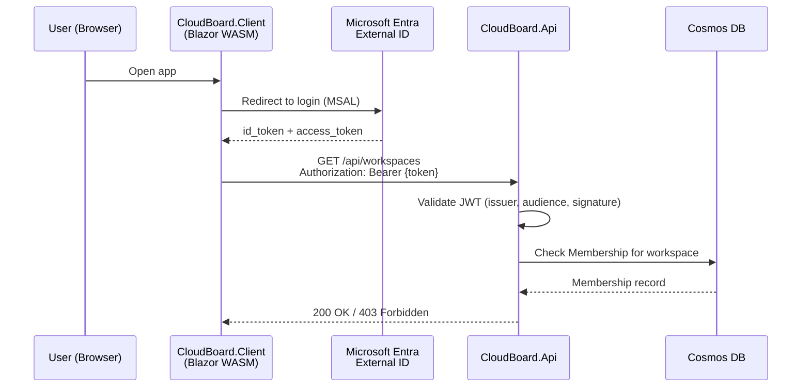

### Role model

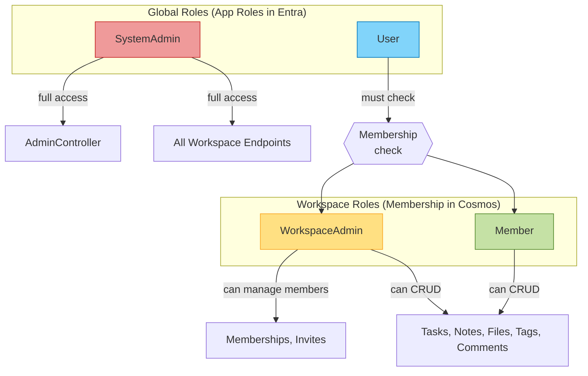

| Role | Scope | Stored in | Access |
|---|---|---|---|
| `SystemAdmin` | Global | Entra app role | Full admin portal + all workspaces |
| `User` | Global | Entra app role (default) | Must be a workspace member to access workspace data |
| `WorkspaceAdmin` | Per-workspace | Cosmos `Membership` (roleInWorkspace) | Manage members, invites; full CRUD within workspace |
| `Member` | Per-workspace | Cosmos `Membership` (roleInWorkspace) | CRUD tasks, notes, files, tags, comments within workspace |

### Auth configuration per app

| App | Auth Method | Library | Notes |
|---|---|---|---|
| CloudBoard.Client (WASM) | MSAL.js (redirect flow) | `Microsoft.Authentication.WebAssembly.Msal` | Standalone WASM, obtains access tokens for API |
| CloudBoard.AdminPortal (Server) | OpenID Connect (cookie-based) | `Microsoft.Identity.Web` | Server-side, session cookie after login |
| CloudBoard.Api | JWT Bearer validation | `Microsoft.Identity.Web` | Validates tokens from both Client and AdminPortal |

### Entra App Registrations

| Registration | Used by | Notes |
|---|---|---|
| **CloudBoard API** | Api, AdminPortal | Exposes `access_as_user` scope; defines app roles |
| **CloudBoard Client** | Client (WASM) | Requests `access_as_user` scope from API registration |

> Admin Portal **shares** the API registration — it authenticates via OIDC and uses cookies server-side.

---

## Cosmos DB Design

### Container layout

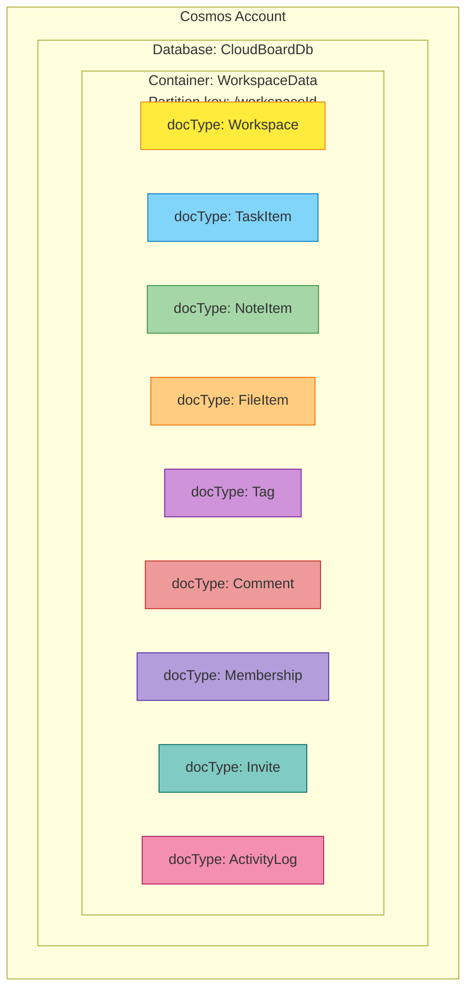

### Query patterns

| Query | Partition used? | Cost |
|---|---|---|
| Get all tasks for workspace X | ✅ Single partition (workspaceId = X, docType = TaskItem) | Low (1–5 RU) |
| Get single task by id + workspaceId | ✅ Point read | Very low (1 RU) |
| Get all workspaces for user | ❌ Cross-partition (fan-out on ownerUserId) | Higher — consider indexing |
| Get all activity logs (Admin) | ❌ Cross-partition scan | Expensive — use sparingly |

### Repository hierarchy

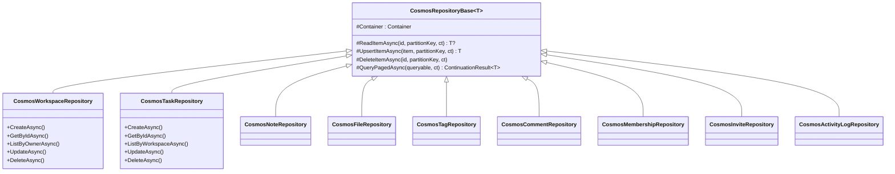

### Cosmos LINQ warnings

> ⚠️ **Cosmos LINQ ≠ EF LINQ**
> - No lazy loading, no navigation properties.
> - Use `.ToFeedIterator()` not `.ToListAsync()` — the latter pulls everything into memory.
> - Not all LINQ operators are supported (e.g., no `GroupBy`, limited `Select` projections).
> - Always test queries in the Cosmos emulator or Data Explorer to check RU costs.

---

## Blob Storage Design

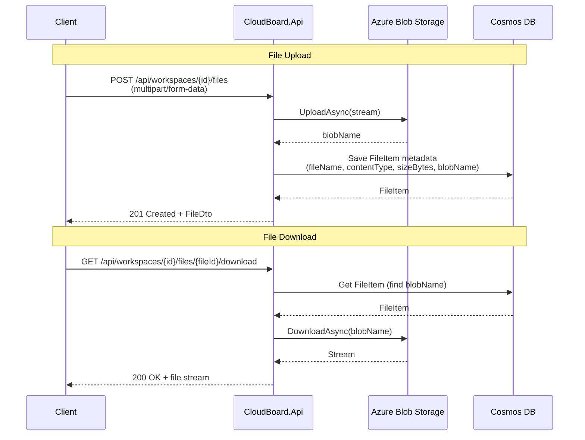

### Blob naming convention

```
cloudboard-files/
  └── {workspaceId}/
      └── {fileId}/{originalFileName}
```

### Tangent extension points (future weeks)

| Feature | Status | Notes |
|---|---|---|
| Upload / Download | ✅ Implemented | Via `IBlobStorageService` |
| Versioning | 🔲 Placeholder | Append version suffix to blob name |
| Soft delete | 🔲 Placeholder | Set `isDeleted` flag on FileItem |
| SAS sharing links | 🔲 Placeholder | `GenerateSasUrlAsync()` method stub exists |
| Direct-to-blob upload | 🔲 Tangent | Client uploads directly to Blob with SAS; API saves metadata only |

---

## Azure Functions Integration

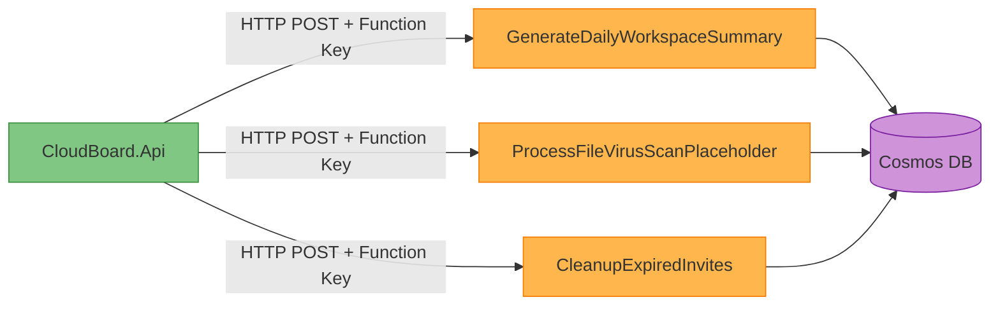

| Function | Trigger | Purpose |
|---|---|---|
| `GenerateDailyWorkspaceSummary` | HTTP (POST) | Aggregates ActivityLog entries for a workspace into a daily summary |
| `ProcessFileVirusScanPlaceholder` | HTTP (POST) | Placeholder pipeline — logs that scan occurred, no real scanning |
| `CleanupExpiredInvites` | HTTP (POST) | Deletes Invite documents past their `ExpiresUtc` |

### Calling pattern from API

```csharp
// In the API controller or handler:
await _functionsClient.TriggerDailySummaryAsync(workspaceId, ct);

// IFunctionsClient interface (Application layer)
// FunctionsClient implementation (Infrastructure layer)
// Calls: POST {baseUrl}/api/GenerateDailyWorkspaceSummary?code={functionKey}
```

### Security

- Function keys are stored in `appsettings.json` (local) or Azure Key Vault (production).
- The client app **never** has the function key — only the API does.
- In production, consider adding VNet integration or IP restrictions for defense-in-depth.

---

## Paging Strategy

CloudBoard uses **continuation-token-based paging** instead of offset/skip paging.

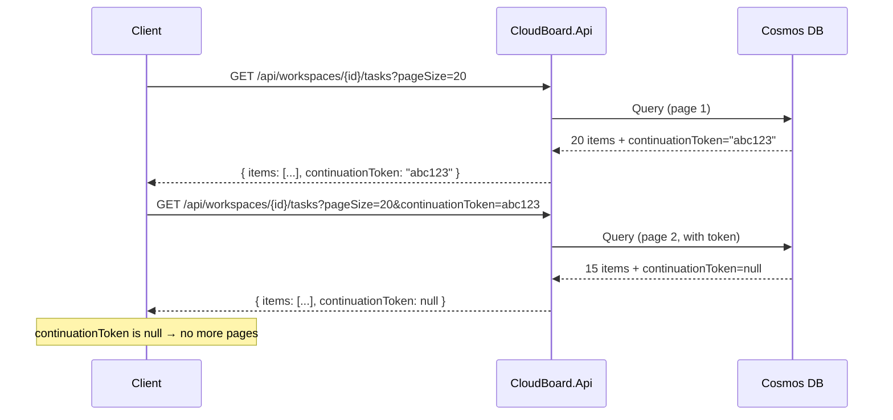

### Why continuation tokens?

| Aspect | Continuation Token | Offset / Skip |
|---|---|---|
| **Cosmos cost** | Low — DB remembers position | High — DB must scan and discard N rows |
| **Consistency** | Stable — new inserts don't shift pages | Unstable — inserts cause duplicate/missing rows |
| **Implementation** | Opaque string from Cosmos SDK | Simple integer math |
| **Client complexity** | Must store token between requests | Just increment page number |

### Response shape

```json
{
  "items": [
    { "id": "...", "title": "My Task", "isDone": false, ... },
    { "id": "...", "title": "Another Task", "isDone": true, ... }
  ],
  "continuationToken": "eyJjb250aW51YXRpb24i..."
}
```

When `continuationToken` is `null`, the client knows there are no more pages.

---

## Feature Flags & Swappable Infrastructure

CloudBoard uses **feature flags** in `appsettings.json` to toggle between in-memory stubs and real Azure services.

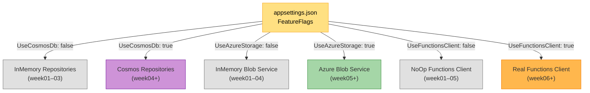

```json
{
  "FeatureFlags": {
    "UseCosmosDb": false,
    "UseAzureStorage": false,
    "UseFunctionsClient": false
  }
}
```

This means:
- **Week 01**: All flags `false` — runs entirely in-memory with zero Azure dependencies.
- **Week 04**: Flip `UseCosmosDb` to `true` — now using real Cosmos DB.
- **Week 05**: Flip `UseAzureStorage` to `true` — real Blob Storage for file uploads.
- **Week 06**: Flip `UseFunctionsClient` to `true` — API calls real Azure Functions.

> **Why?** Students can run the full solution locally from day one without installing the Cosmos emulator or creating Azure resources. Each week "turns on" a new integration.
